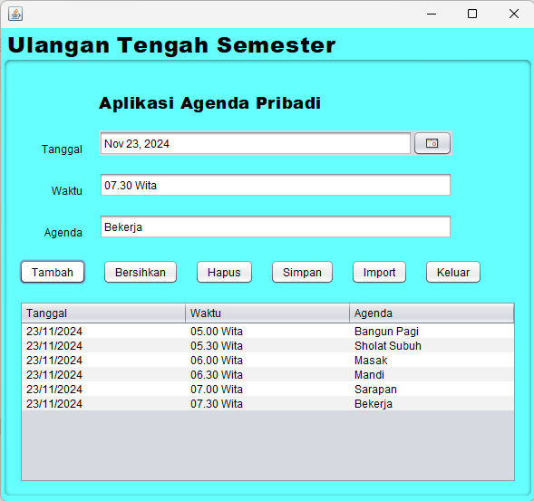

# Aplikasi Agenda Pribadi
Aplikasi Agenda Pribadi adalah aplikasi berbasis Java yang dirancang untuk membantu pengguna mengelola jadwal pribadi mereka dengan mudah dan efisien. Dengan aplikasi ini, pengguna dapat mencatat, menyimpan, menghapus, dan mengimpor agenda harian mereka.

# Keunggulan Aplikasi
- *Mencatat Agenda Pribadi*:
Aplikasi ini memungkinkan pengguna untuk mencatat informasi penting, seperti tanggal, waktu, dan deskripsi agenda.

- *Antarmuka Pengguna yang Mudah*:
Dibangun dengan Java, aplikasi ini memiliki tampilan sederhana yang mudah dipahami oleh semua kalangan.

- *Fitur Impor dan Simpan File*:
Pengguna dapat menyimpan agenda mereka ke file CSV untuk backup atau mengimpor data dari file CSV untuk mempermudah pengelolaan jadwal.

- *Validasi Data*:
Aplikasi memverifikasi input pengguna untuk memastikan data yang dimasukkan valid, seperti memastikan tanggal, waktu, dan agenda tidak kosong.

# Pembuat Aplikasi
UTS PBO 2 - Muthya Adylla - 2210010476 - 5C Reg Pagi Bjm

# Fitur Utama
- *Menambahkan Agenda Baru*:
Pengguna dapat memasukkan tanggal, waktu, dan deskripsi agenda, kemudian menambahkannya ke tabel agenda.

- *Menghapus Agenda*:
Pilih agenda dari tabel dan hapus dengan satu klik.

- *Impor Data*:
Pengguna dapat memuat data agenda dari file CSV.

- *Simpan File CSV*:
Agenda yang tercatat dapat disimpan dalam format CSV untuk backup dan referensi di perangkat.

- *Bersihkan Data *:
Tombol Bersihkan memungkinkan pengguna mengosongkan input untuk memasukkan data baru.

- *Keluar*:
Pengguna dapat menutup aplikasi dengan tombol Keluar.

# Cara Menjalankan
1. Unduh proyek aplikasi ke komputer Anda.
2. Pastikan Java Development Kit (JDK) telah diinstal di komputer.
3. Buka proyek di IDE seperti NetBeans.
4. Jalankan file AgendaPribadi.java.
5. Aplikasi akan terbuka dan siap digunakan.

# Demo Aplikasi

